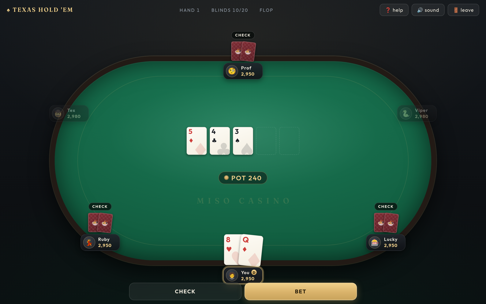

# ♠️ texasholdem

**No-limit Texas hold 'em** — a six-max table against five AI rivals,
with real side pots and rising blinds — built with
[miso](https://github.com/dmjio/miso) and compiled to WebAssembly.

**Play it live: <https://texasholdem.haskell-miso.org>**




- 🃏 The full game: blinds, four betting streets, check/call/bet/raise
  with a proper **min-raise rule** (under-raise all-ins don't reopen the
  action), all-in runouts, **side pots**, split pots with the odd chip
  going left of the button, and heads-up button rules
- 🤖 Five table villains with five temperaments — aggression, looseness,
  and bluff frequency tuned per seat — playing Chen-formula preflop
  ranges and pot-odds poker after the flop
- 📈 Tournament arc: blinds rise every 8 hands; bust your rivals to
  become champion
- 💡 At showdown the winning five cards **light up**, and every pot is
  named ("Full House, Kings full of Fours")
- 🎚 A proper raise tray: slider plus MIN / ½ POT / POT / MAX presets
- ⌨️ Full keyboard play: F fold, C or space check/call, R raise (arrows
  size it, enter confirms), A all-in
- 📱 Mobile-first table: the felt goes portrait on phones, buttons are
  thumb-sized, and the layout respects safe areas
- 🔊 Sound effects synthesized live with the Web Audio API — ceramic
  chip clicks, card slides, a knuckle check, an all-in riser (zero
  audio assets)
- 🎰 Modern casino lounge look: one pool of light over an emerald
  stadium of felt, champagne-gold chrome, glass panels, crisp ivory
  cards — built on `Miso.Lens`, `Miso.CSS`, and `Miso.CSS.Color`

## The engine

All rules live in pure modules (`Cards`, `Eval`, `Poker`, `Bots`) that
know nothing about the DOM:

- `Eval` picks the best five of seven with full kicker tie-breaking
- `Poker` is the betting state machine: dealing, blinds, streets,
  legality of every move, side pots, showdown
- `Bots` decides for the villains from a supply of uniform randoms, so
  every decision is reproducible

## Build (WASM)

```bash
nix develop .#wasm --command make
make serve   # serves public/ on :8080
```

## Tests

The engine is tested natively:

```bash
cabal test
```

Checks include: the evaluator against known hands (the wheel, kicker
ties, two-trips full houses, three-pair collapses), betting rules
(min-raise, under-raise all-ins, heads-up order), engineered side-pot
and split-pot scenarios — and bot-vs-bot tournament fuzzing where **chip
conservation is asserted after every hand**.

CI builds with nix and deploys `public/` to GitHub Pages on pushes to
`master`.
